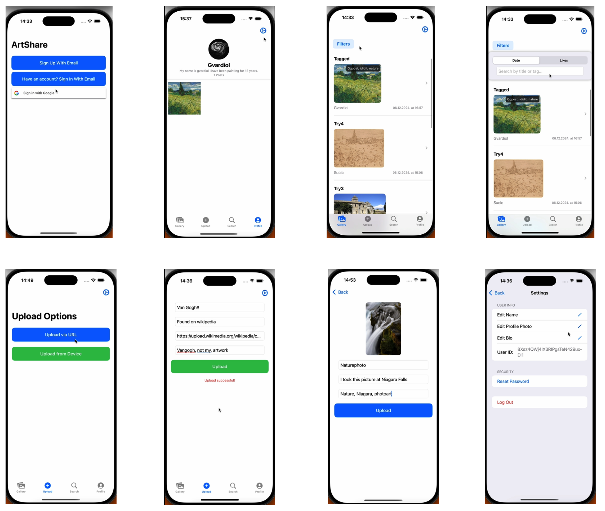

# ArtShare - iOS Art Community App

   

**ArtShare** is a social platform designed for artists and art enthusiasts to share, discover, and interact with creative works. Built entirely with **SwiftUI** and powered by **Firebase**, the app demonstrates modern iOS development practices including reactive UI, asynchronous data handling, and secure authentication.

---

## Features

### Authentication & Security
* **Multi-Method Sign In:** Secure login via Email/Password and **Google Sign-In**.
* **Session Management:** Persistent user sessions using Firebase Auth.

### Gallery & Discovery
* **Dynamic Feed:** Browse artworks with real-time updates.
* **Filtering & Sorting:** Filter posts by tags, dates, or popularity (likes).
* **Search Engine:** Find other users and artists by name.

### Content Creation
* **Dual Upload Options:** Upload artworks directly from the **Photo Library** or via **URL**.
* **Metadata:** Add titles, descriptions, and dynamic tags to artworks.

### Social Interaction
* **Engagement:** Like and comment on posts in real-time.
* **Community Management:** Delete own comments and manage interactions.
* **Profile System:** Customizable user profiles with bio, profile photo, and personal art portfolio.

---

## Tech Stack & Architecture

* **Language:** Swift
* **UI Framework:** SwiftUI
* **Backend:** Firebase
    * **Authentication:** Identity management (Google & Email).
    * **Firestore:** NoSQL database for users, posts, and comments.
    * **Storage:** Storing image assets.
* **Architecture:** **MVVM** (Model-View-ViewModel) pattern.
* **Concurrency:** Heavy usage of Swift's `async/await`.
* **Dependency Management:** Swift Package Manager (SPM).

---

## Project Structure

The project is organized into a modular structure under the `Mains` directory:

```text
ArtShare/
├── ArtShare/
│   ├── ArtShareApp.swift       # App Entry Point
│   ├── Mains/
│   │   ├── Authentication/     # Auth Logic & Views (Sign In/Up)
│   │   ├── FireStore/          # Database Managers (UserManager)
│   │   ├── MainViews/          # Primary Screens (Gallery, Profile, Search, TabView)
│   │   ├── Settings/           # User Settings & Profile Editing
│   │   ├── SideViews/          # Sub-views (PostDetail, Comments, Thumbnails)
│   │   ├── Upload/             # Upload Logic & ImagePicker
│   │   └── ContentView.swift   # Root View
│   ├── Utilities/              # Helper Classes (ViewControllerFinder)
│   ├── Assets.xcassets/        # Images & Colors
│   └── Info.plist
├── ArtShare.xcodeproj
└── Documents/                  # Presentations & Reports
```

## Getting Started

### Prerequisites
* **Xcode 15.0** or later
* **iOS 16.0** or later

### Installation

1.  **Clone the repository:**
    ```bash
    git clone [https://github.com/denzulu/ArtShare.git](https://github.com/denzulu/ArtShare.git)
    cd ArtShare
    ```

2.  **Open the project:**
    Double-click `ArtShare.xcodeproj` to open the project in Xcode.

3.  **Firebase Configuration (Required):**
    * This project uses Firebase for Authentication and Firestore. The `GoogleService-Info.plist` file is **excluded** from this repository for security.
    * Create a project in the [Firebase Console](https://console.firebase.google.com/).
    * Download your `GoogleService-Info.plist`.
    * Drag and drop this file into the **ArtShare** folder within Xcode (where `ArtShareApp.swift` is located).
    * Ensure "Copy items if needed" is checked.

4.  **Run the App:**
    Select a simulator (e.g., iPhone 15 Pro) and press `Cmd + R` to build and run.

---

## App Overview & Visuals

The application features a complete flow from authentication to content creation. Below is a preview of the user interface:



### 📊 Detailed Presentation
For a complete visual walkthrough, user flow diagrams, and design decisions, please check the project presentation:
👉 **[Download ArtShare Presentation](./Documents/ArtShare_Presentation.pptx)**

---

## Documentation

The project includes detailed documentation regarding the architecture, design choices, and future improvements. You can find the following files in the repository:

* **Project.docx:** Detailed technical report covering the MVVM architecture, database schema, and feature breakdown.
* **ArtShare_Presentation.pptx:** A presentation slide deck summarizing the project flow, challenges (e.g., Google Sign-In integration), and core features.

---

## Author

**Huseyin Deniz Ulu**
* Student at **Bilkent University (CTIS)**
* Focus: iOS Development, Data Science
